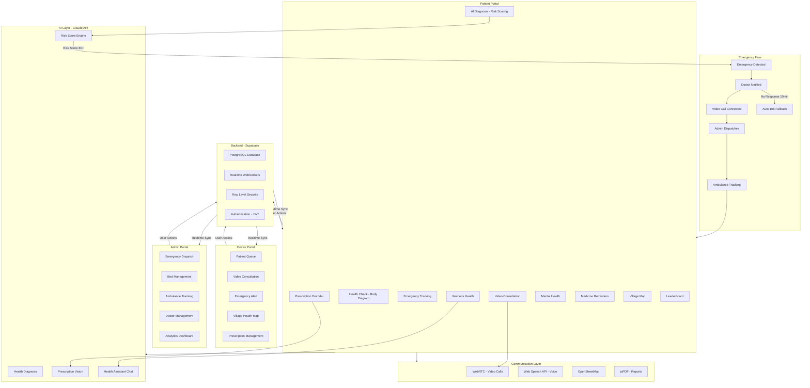

# MediAI — Rural Healthcare Intelligence Platform

MediAI connects rural Indians to doctors through AI-powered remote consultations,
automatic emergency detection, and real-time ambulance dispatch — in Telugu, Hindi,
and English.

"Healthcare for every Indian. Not just city Indians."

---

## The Problem

800 million Indians live in villages. 80% of doctors serve only cities.
When something goes wrong, emergency response takes 4 to 6 hours.

The gap is not medical. It is logistical. MediAI closes it.

Core gaps we target:
- No doctor reachable within practical distance
- No emergency detection or dispatch pipeline
- English-only apps exclude most rural users
- Women have no private health space digitally
- Zero village-level health monitoring exists
- Patients cannot read or understand prescriptions

---

## What We Built

Three connected portals — Patient, Doctor, Admin — that work as one system.

A patient checks symptoms. The AI scores risk. A doctor joins via video.
If it is serious, an ambulance is dispatched automatically.
Help arrives in under 15 minutes. Free. In their language.

---

## Key Features

Patient portal
- Symptom checker        — select symptoms, AI scores risk 0-100
- Book a doctor          — see availability, book appointment in two taps
- Video consultation     — connect with doctor remotely, zero cost
- AI health assistant    — chat based health guidance anytime

Doctor portal
- Patient queue          — full medical history loaded before consultation starts
- Video consultation     — two-panel view, patient vitals visible during call
- Digital prescriptions  — write, sign, and send prescriptions from the portal

Admin portal
- Bed management         — real-time status across all wards
- Ambulance tracking     — live fleet positions on map
- Doctor management      — register doctors, monitor workload distribution
- Hospital analytics     — admissions, response times, occupancy in one view

---

## Additional Features

- Prescription decoder   — scan any paper prescription, AI explains each medicine
                           in the patient's own language
- Women's health         — period tracker, pregnancy week guide, wellness assistant
- Mental health          — mood check-ins, stress tracking, crisis helpline access
- Village health map     — real-time community zones, outbreak alerts
- Health leaderboard     — villages compete on health scores, drives prevention
- Health report PDF      — full checkup summary, downloadable after every visit
- Medicine reminders     — custom daily medication schedule with alerts
- Voice input            — speak symptoms in your language, no typing needed
- Multilingual support   — full UI and AI responses in Telugu, Hindi, and English

---

## How We Are Different

| Others | MediAI |
|---|---|
| Information only | Takes action automatically |
| English only | Telugu, Hindi, English |
| Paid consultations | Free |
| No emergency pipeline | Auto detect and dispatch |
| City focused | Built for rural India |
| Partial solutions | Complete ecosystem |

---

## Emergency Flow

Patient reports symptoms → AI scores risk 0-100 → if score above 80,
doctor is notified on three channels simultaneously → WebRTC video
connects in 60 seconds → doctor confirms → admin dispatches bed and
ambulance in one click → patient tracks ambulance live → arrival under
15 minutes. Auto 108 fallback triggers if no doctor responds in
10 minutes.

---

## Architecture

---

## Stack

| Layer | Choice | Reason |
|---|---|---|
| Frontend | React 18 + TypeScript | Type-safe, fast |
| Styling | Tailwind + Framer Motion | Responsive with transitions |
| Backend | Supabase | Realtime, RLS, Auth out of the box |
| AI | Anthropic Claude API | Medical accuracy, Indic language support |
| Video | WebRTC | Zero cost at scale |
| Voice | Web Speech API | Telugu, Hindi, English natively |
| Maps | OpenStreetMap | Free, Indian village coverage |
| PDF | jsPDF | Client-side report generation |
| i18n | i18next | Runtime language switching |

---

## Impact

| Metric | Current | With MediAI |
|---|---|---|
| Emergency response | 4-6 hours | 15 minutes |
| Doctor reach | 1 village | 10 villages |
| Consultation cost | Rs 200-500 | Free |
| Language support | English | Telugu, Hindi, English |
| Village health data | None | Real-time |

Scale plan: Telangana first (5M patients), then South India (50M),
then pan-India (500M). No new government infrastructure required.

---

## Team — EliteOrbit, BVRIT Narsapur

Gurrala Rishikesh — Lead, Full Stack
K. Pooja Sisira — Frontend
K. Vijaya Sri — Backend, Database
K. Keerthana — AI Integration